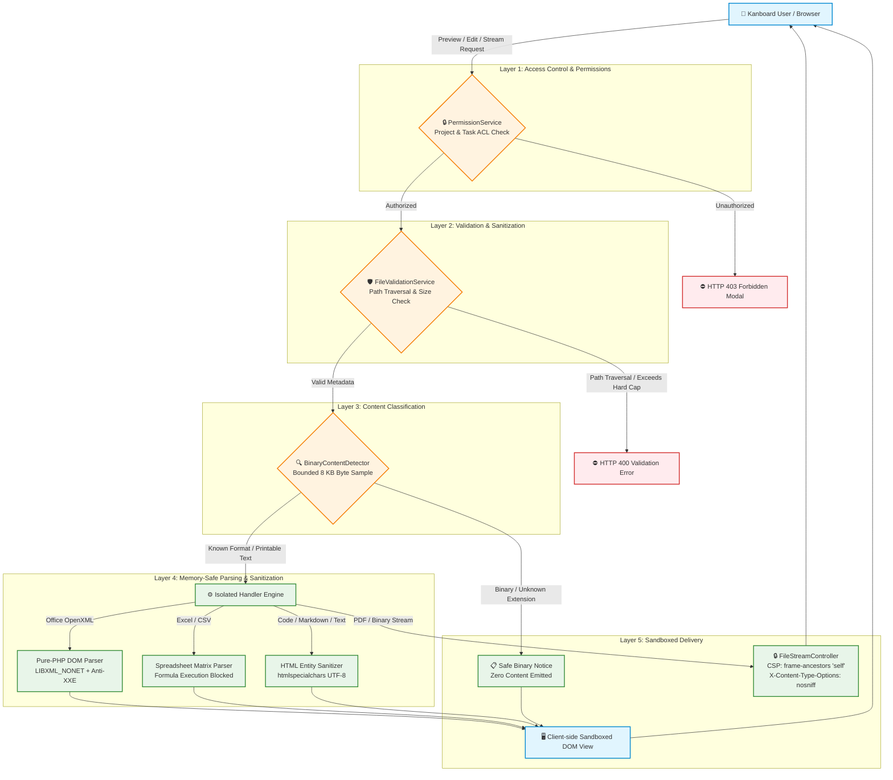

# Kanboard FileInteractionCore Plugin

> **Enterprise-grade, memory-safe file preview, streaming, and editing framework for Kanboard task & project attachments.**

[](https://github.com/youssefboutaleb/kanboard-file-attachment-interaction/actions)


---

## 🌟 Overview

`FileInteractionCore` transforms Kanboard attachment management into a modern, interactive workspace. It enables team members to preview, inspect, stream, and edit documents, presentations, spreadsheets, PDFs, Markdown files, code snippets, and configuration files directly inside Kanboard modals — **without requiring third-party desktop software or modifying Kanboard core files**.

Designed with a **defense-in-depth security architecture**, all user uploads are treated as untrusted hostile input: active scripts are never executed, XML entity injection is neutralized, plain text outputs are entity-escaped, and PDF streaming enforces strict same-origin Content Security Policies.

---

## ✨ Features & Supported Formats

| Format Category | Supported Extensions | Capabilities & Features |
| :--- | :--- | :--- |
| **Word Documents** | `.docx`, `.dotx`, `.doc` | High-fidelity client-side DOM rendering (`docx-preview`), pagination & typography preservation, pure-PHP OpenXML fallback parser, legacy `.doc` notice. |
| **PowerPoint Presentations** | `.pptx`, `.potx`, `.ppt` | Interactive presentation slide deck viewer with navigation controls (Prev/Next/Tabs/Keyboard), pure-PHP slide ordering fallback, legacy `.ppt` notice. |
| **Excel Spreadsheets** | `.xlsx`, `.xls` | In-browser multi-sheet workbook preview with sheet tabs, interactive grid spreadsheet editor with formula bar, cell editing, row/col addition, CSV/XLSX bidirectional conversion. |
| **CSV & Tabular Data** | `.csv`, `.tsv` | Responsive tabular preview with dynamic delimiter detection (`,`, `;`, `\t`, `\|`), delimiter switcher, header row toggle, and interactive spreadsheet grid editor. |
| **PDF Documents** | `.pdf` | High-performance inline streaming bypassing `X-Frame-Options: DENY` via CSP `frame-ancestors 'self'`, native browser PDF viewer embedding, "Open in new tab" action. |
| **Markdown Documents** | `.md`, `.markdown` | Sanitized rich HTML rendering, heading and code block counters, "Rendered / Raw" mode switcher. |
| **Source Code & Configs** | `.json`, `.yml`, `.yaml`, `.xml`, `.html`, `.sh`, `.bash`, `.py`, `.php`, `.js`, `.css`, `.sql` | Token-based syntax highlighting, line numbering, interactive syntax language selector (`Python`, `Bash`, `JavaScript`, etc.). |
| **Live Editor & Versioning** | Plain text, Code, CSV, TSV, XLSX | In-app live text & spreadsheet editor, JSON syntax validation, safe in-place updates or version branching (`document_v2.txt`). |
| **Unclassified Files** | Any extension / no extension | Bounded 8 KB byte inspection: printable text is rendered with syntax highlighting, binary payloads receive a safe download prompt without loading content into memory. |
| **Unified Action Bar** | All formats | Standardized bottom action bar: File type label, Rendered/Raw toggle, Edit switcher, Fullscreen modal toggle, Download action. |

---

## 🛡️ Security Architecture & Safety Model

`FileInteractionCore` enforces a multi-layer defense-in-depth security model to guarantee that uploaded files cannot expose data, hijack sessions, or execute malicious payloads.



### Security Guarantees
1. **Zero Execution of Untrusted Files**: Uploaded PHP, Python, Shell, HTML, SVG, or executable files are **never executed** by the web server or rendered directly as active browser scripts.
2. **XSS Neutralization**: All text strings, table cell values, slide notes, and JSON payloads are converted to safe HTML entities (`ENT_QUOTES | ENT_SUBSTITUTE, 'UTF-8'`) before template interpolation.
3. **Memory-Safe OpenXML Parsing**: Microsoft Word and PowerPoint OpenXML ZIP structures are parsed using pure-PHP DOM traversal with `LIBXML_NONET | LIBXML_NOBLANKS`, preventing XML External Entity (XXE) and Server-Side Request Forgery (SSRF) attacks.
4. **Path Traversal Protection**: File paths are strictly sanitized with `basename()` and isolated by Kanboard internal numeric attachment IDs.
5. **Frame-Ancestors CSP Framing**: Inline PDF and binary streams override default `X-Frame-Options: DENY` using modern `Content-Security-Policy: default-src 'none'; frame-ancestors 'self'`, restricting embedding to same-origin contexts while stopping clickjacking.
6. **Bounded Memory Consumption**: Hard size limits (500 KB for text/code, 5 MB for Excel, 10 MB for PDF/Word, 15 MB for PowerPoint) prevent Denial-of-Service via memory exhaustion.

---

## ✅ Requirements

| Requirement | Version | Notes |
|---|---|---|
| **Kanboard** | **≥ 1.2.23** | The floor is set by the `template:project-overview:documents:dropdown` hook, which core gained in 1.2.23 (it is absent from 1.2.22). `Plugin::getCompatibleVersion()` declares this, so an older core refuses the plugin cleanly instead of silently dropping the project-attachment menu entry. |
| **PHP** | **≥ 8.1** | The source uses `match`, `str_contains` and `?->`. |
| PHP `zip` extension | required | OpenXML parsing (`.docx`, `.pptx`, `.xlsx`) and Kanboard's own remote plugin installer. |
| PHP `dom` / `libxml` | required | OpenXML parsing. Parsers run with `LIBXML_NONET`. |
| PHP `mbstring` | recommended | Correct multibyte truncation in previews. |

No database schema, no migrations, and no configuration are required — the plugin adds no
tables and reads no settings. Nothing needs to be enabled after installation.

---

## 📦 Installation Guide

### Option 1: Install from GitHub Release (Recommended)

1. Navigate to the [Releases](https://github.com/youssefboutaleb/kanboard-file-attachment-interaction/releases) page.
2. Download the latest release archive: `FileInteractionCore-1.1.1.zip`.
3. Extract the archive into your Kanboard `plugins/` directory:
   ```bash
   cd /path/to/kanboard/plugins
   unzip /path/to/FileInteractionCore-1.1.1.zip
   ```
4. Ensure the folder name inside `plugins/` is **`FileInteractionCore`**:
   ```bash
   ls -la /path/to/kanboard/plugins/FileInteractionCore
   # Should display Plugin.php, src/, Template/, Assets/, etc.
   ```
5. Ensure proper file ownership and permissions:
   ```bash
   chown -R www-data:www-data /path/to/kanboard/plugins/FileInteractionCore
   chmod -R 755 /path/to/kanboard/plugins/FileInteractionCore
   ```
6. Log in to Kanboard as an administrator and verify that **FileInteractionCore** is listed under **Settings → Plugins**.

---

### Option 2: Install via Git Clone

```bash
cd /path/to/kanboard/plugins
git clone https://github.com/youssefboutaleb/kanboard-file-attachment-interaction.git FileInteractionCore
chown -R www-data:www-data FileInteractionCore
```

---

### Option 3: Local Testing with Docker

To test `FileInteractionCore` in an isolated Kanboard environment:

```bash
# Clone repository
git clone https://github.com/youssefboutaleb/kanboard-file-attachment-interaction.git FileInteractionCore
cd FileInteractionCore

# Launch Kanboard container with plugin mounted
docker compose up -d
```

Open your browser at `http://localhost:8085` (default login: `admin` / `admin`). The
repository is bind-mounted into the container, so edits are picked up on reload.

---

## ⬆️ Upgrading

The plugin stores no data of its own, so upgrading is a straight directory replacement:

```bash
cd /path/to/kanboard/plugins
rm -rf FileInteractionCore                       # no plugin data is lost
unzip /path/to/FileInteractionCore-1.1.1.zip
chown -R www-data:www-data FileInteractionCore
```

Confirm the new version under **Settings → Plugins**. Clear the browser cache if a
control looks stale — Kanboard fingerprints asset URLs by `filemtime`, so a restored
backup with old timestamps can serve cached JavaScript.

> **Upgrading from any version below 1.1.0 is a security update.** Releases before 1.1.0
> did not verify that an attachment belonged to the task and project named in the URL, and
> their permission layer approved every request at runtime. See [CHANGELOG.md](CHANGELOG.md).

---

## 🗑️ Uninstallation

```bash
rm -rf /path/to/kanboard/plugins/FileInteractionCore
```

That is the whole procedure. The plugin creates no tables, writes no settings and leaves
no rows behind; task attachments are Kanboard's own and are untouched. Once the directory
is gone, attachment menus revert to core's built-in behaviour.

---

## ⚠️ Limitations

Worth knowing before installing:

- **Images, audio and video are deliberately excluded.** Core already renders them, and
  keeping them out guarantees no URL can route active content (notably `.svg`) into a
  preview path.
- **Previews are capped.** Text formats truncate at 500 KB; PDFs are refused above 10 MB.
  An attachment whose recorded size exceeds the ceiling is never read into memory at all —
  the notice is answered from metadata.
- **The editor is not collaborative.** Two people editing the same attachment is
  last-write-wins; there is no locking and no merge.
- **Only text-ish formats are editable** — plus spreadsheets through the grid editor.
  Saving an `.xlsx` rewrites it from the grid, so anything the parser does not model
  (formulas, charts, images, macros, conditional formatting) is **not preserved**. Keep a
  copy before editing a spreadsheet that carries more than values.
- **DOCX/PPTX previews are renderings, not editors.** They are read-only.
- **Legacy binary Office formats** (`.doc`, `.ppt`, `.xls` in the pre-2007 OLE2 layout)
  are detected and offered as downloads rather than parsed.
- **`.svg` is never previewed or streamed inline**, by design.

---

## 🔧 Troubleshooting

| Symptom | Cause and fix |
|---|---|
| Plugin missing from **Settings → Plugins** | The directory must be named exactly `FileInteractionCore`; Kanboard derives the plugin class from the folder name. Extracting a GitHub source archive produces `kanboard-file-attachment-interaction-1.1.1/` — rename it. |
| Listed as **not compatible** | Your Kanboard is older than 1.2.23. Check **Settings → About**. |
| Preview entry missing from the attachment menu | Core owns images/audio/video and the plugin does not attach to them. For other formats, confirm the web server user can read the plugin directory. |
| PDF shows "Inline PDF viewing is not supported" | The embedded viewer needs the plugin's own `/stream` route, which replaces core's `X-Frame-Options: DENY` with `frame-ancestors 'self'`. A reverse proxy adding its own `X-Frame-Options` will re-break it — drop that header for Kanboard, or set `ENABLE_XFRAME` to `false` in `config.php`. |
| Controls do nothing, console shows CSP errors | An inline `<script>` has been introduced somewhere. Kanboard's CSP is `default-src 'self'` without `'unsafe-inline'`, and modal content is injected with `innerHTML`, which never executes injected scripts. All behaviour must ship as a file registered on `template:layout:js`. |
| "Access Denied: this attachment does not belong to…" | Working as intended since 1.1.0 — the attachment id does not belong to the task/project in the URL. Reopen it from its own task. |
| Blank modal on a large file | The attachment exceeds the read ceiling. See **Limitations**. |

---

## 📖 Usage Guide

### Previewing Files
1. Open any task in your Kanboard project.
2. Scroll to the **Attachments** section.
3. Click the dropdown arrow (`...`) on any attachment and select **Preview**:
   - **Word/PowerPoint**: Renders in the high-fidelity office reading pane or structured slide viewer.
   - **Spreadsheets**: Displays workbook sheet tabs and formatted table cells.
   - **PDF**: Loads directly in the embedded PDF viewer.
   - **Code/Markdown/Text**: Renders with syntax highlighting or rich typography.
4. Use the bottom action bar to toggle **Rendered / Raw**, switch syntax highlighting languages, enter **Fullscreen**, or **Edit**.

### Editing Attachments & Versioning
1. In the preview modal or attachment dropdown, click **Edit**.
2. For spreadsheets (`.xlsx`, `.csv`, `.tsv`), use the interactive grid editor to modify cells, add rows/columns, or switch sheets.
3. For text/code files, use the live Monaco/CodeMirror-style text editor with real-time JSON/syntax validation.
4. Choose your save mode:
   - **Overwrite**: Updates the existing attachment in place.
   - **Save as Revision**: Automatically creates a versioned copy (`report_v2.xlsx`) and preserves previous versions.

---

## 🏛️ Architecture & Extension Points

`FileInteractionCore` adheres to clean software design patterns (Strategy, Registry, Concerns):

- **[Architecture Documentation](docs/ARCHITECTURE.md)**: Deep dive into class structures, sequence flows, and component lifecycles.
- **[Security Policy](docs/SECURITY.md)**: Complete threat models and vulnerability mitigation details.
- **[Contributing Guide](CONTRIBUTING.md)**: Developer setup, coding standards, and how to create custom format handlers.
- **[Project Roadmap](docs/ROADMAP.md)**: Strategic vision and planned next-generation features.

---

## 🧪 Testing & Quality Assurance

The codebase includes an extensive automated test suite with **770 unit and integration tests** and Level 8 static analysis:

```bash
# Run the complete agentic automated verification pipeline
composer agent-verify

# Run PHPUnit unit & integration tests
composer test

# Run PHPStan static analysis (Level 8)
composer phpstan
```

If PHP and Composer are not on the host, `scripts/agent-verify.sh` routes everything
through `php:8.1-cli` and `composer:2` containers automatically. To run the suite directly:

```bash
docker run --rm -v "$(pwd)":/app -w /app php:8.1-cli vendor/bin/phpunit
```

---

## 🚀 Release Process

`Plugin.php::getPluginVersion()` is the single source of truth; `composer.json` carries no
`version` field on purpose, because it would fail `composer validate --strict`.

1. Update `getPluginVersion()` and add the matching `## [x.y.z]` section to `CHANGELOG.md`.
   `PackagingTest` fails if these disagree.
2. `composer test && composer phpstan`
3. `bash scripts/package-plugin.sh` → `dist/FileInteractionCore-<version>.zip`.
   The archive is built from an explicit allow-list and the build aborts if a development
   file leaks in or the root entry is not `FileInteractionCore/`.
4. Tag and push: `git tag v<version> && git push origin v<version>`.
   `.github/workflows/release.yml` re-verifies that the tag matches `Plugin.php`, rebuilds
   the archive, extracts the changelog section, and publishes the GitHub Release with the
   ZIP attached. Release archives are never committed to the repository.

---

## 🗺️ Roadmap & Next-Generation Features

- **v1.0.0**: Production Release & Performance Benchmarking. *(released)*
- **v1.1.0**: Object-level authorization hardening & contributability release.
- **v1.1.1**: Licensing and documentation follow-up. *(current)*
- **v1.2.0**: File Revision Diff Viewer (side-by-side visual diff for versioned text & code).
- **v1.3.0**: Memory-Safe Vector Graphics (`.webp`, sandboxed `.svg` preview).
- **v1.4.0**: Full-Text Search Indexing for attachment contents.
- **v2.0.0**: External Document Server Integration (WOPI / OnlyOffice / Collabora).

See [docs/ROADMAP.md](docs/ROADMAP.md) for full details.

---

## 📄 License

This project is licensed under the **MIT License** — see the [LICENSE](LICENSE) file for details.

Bundled third-party JavaScript keeps its own license; see [NOTICE](NOTICE) for the
full attribution list.
