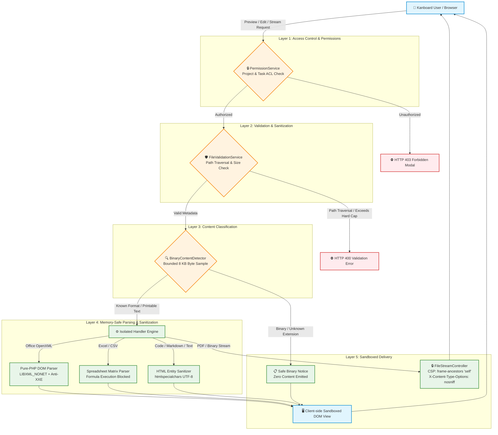

# Kanboard FileInteractionCore Plugin

> **Enterprise-grade, memory-safe file preview, streaming, and editing framework for Kanboard task & project attachments.**

[](https://github.com/youssefboutaleb/kanboard-file-attachment-interaction/actions)


---

## 🌟 Overview

`FileInteractionCore` transforms Kanboard attachment management into a modern, interactive workspace. It enables team members to preview, inspect, stream, and edit documents, presentations, spreadsheets, PDFs, Markdown files, code snippets, and configuration files directly inside Kanboard modals — **without requiring third-party desktop software or modifying Kanboard core files**.

Designed with a **defense-in-depth security architecture**, all user uploads are treated as untrusted hostile input: active scripts are never executed, XML entity injection is neutralized, plain text outputs are entity-escaped, and PDF streaming enforces strict same-origin Content Security Policies.

---

## ✨ Features & Supported Formats

| Format Category | Supported Extensions | Capabilities & Features |
| :--- | :--- | :--- |
| **Word Documents** | `.docx`, `.dotx`, `.doc` | High-fidelity client-side DOM rendering (`docx-preview`), pagination & typography preservation, pure-PHP OpenXML fallback parser, legacy `.doc` notice. |
| **PowerPoint Presentations** | `.pptx`, `.potx`, `.ppt` | Interactive presentation slide deck viewer with navigation controls (Prev/Next/Tabs/Keyboard), pure-PHP slide ordering fallback, legacy `.ppt` notice. |
| **Excel Spreadsheets** | `.xlsx`, `.xls` | In-browser multi-sheet workbook preview with sheet tabs, interactive grid spreadsheet editor with formula bar, cell editing, row/col addition, CSV/XLSX bidirectional conversion. |
| **CSV & Tabular Data** | `.csv`, `.tsv` | Responsive tabular preview with dynamic delimiter detection (`,`, `;`, `\t`, `\|`), delimiter switcher, header row toggle, and interactive spreadsheet grid editor. |
| **PDF Documents** | `.pdf` | High-performance inline streaming bypassing `X-Frame-Options: DENY` via CSP `frame-ancestors 'self'`, native browser PDF viewer embedding, "Open in new tab" action. |
| **Markdown Documents** | `.md`, `.markdown` | Sanitized rich HTML rendering, heading and code block counters, "Rendered / Raw" mode switcher. |
| **Source Code & Configs** | `.json`, `.yml`, `.yaml`, `.xml`, `.html`, `.sh`, `.bash`, `.py`, `.php`, `.js`, `.css`, `.sql` | Token-based syntax highlighting, line numbering, interactive syntax language selector (`Python`, `Bash`, `JavaScript`, etc.). |
| **Live Editor & Versioning** | Plain text, Code, CSV, TSV, XLSX | In-app live text & spreadsheet editor, JSON syntax validation, safe in-place updates or version branching (`document_v2.txt`). |
| **Unclassified Files** | Any extension / no extension | Bounded 8 KB byte inspection: printable text is rendered with syntax highlighting, binary payloads receive a safe download prompt without loading content into memory. |
| **Unified Action Bar** | All formats | Standardized bottom action bar: File type label, Rendered/Raw toggle, Edit switcher, Fullscreen modal toggle, Download action. |

---

## 🛡️ Security Architecture & Safety Model

`FileInteractionCore` enforces a multi-layer defense-in-depth security model to guarantee that uploaded files cannot expose data, hijack sessions, or execute malicious payloads.



### Security Guarantees
1. **Zero Execution of Untrusted Files**: Uploaded PHP, Python, Shell, HTML, SVG, or executable files are **never executed** by the web server or rendered directly as active browser scripts.
2. **XSS Neutralization**: All text strings, table cell values, slide notes, and JSON payloads are converted to safe HTML entities (`ENT_QUOTES | ENT_SUBSTITUTE, 'UTF-8'`) before template interpolation.
3. **Memory-Safe OpenXML Parsing**: Microsoft Word and PowerPoint OpenXML ZIP structures are parsed using pure-PHP DOM traversal with `LIBXML_NONET | LIBXML_NOBLANKS`, preventing XML External Entity (XXE) and Server-Side Request Forgery (SSRF) attacks.
4. **Path Traversal Protection**: File paths are strictly sanitized with `basename()` and isolated by Kanboard internal numeric attachment IDs.
5. **Frame-Ancestors CSP Framing**: Inline PDF and binary streams override default `X-Frame-Options: DENY` using modern `Content-Security-Policy: default-src 'none'; frame-ancestors 'self'`, restricting embedding to same-origin contexts while stopping clickjacking.
6. **Bounded Memory Consumption**: Hard size limits (500 KB for text/code, 5 MB for Excel, 10 MB for PDF/Word, 15 MB for PowerPoint) prevent Denial-of-Service via memory exhaustion.

---

## 📦 Installation Guide

### Option 1: Install from GitHub Release (Recommended)

1. Navigate to the [Releases](https://github.com/youssefboutaleb/kanboard-file-attachment-interaction/releases) page.
2. Download the latest release archive: `FileInteractionCore-v0.9.0.zip`.
3. Extract the archive into your Kanboard `plugins/` directory:
   ```bash
   cd /path/to/kanboard/plugins
   unzip /path/to/FileInteractionCore-v0.9.0.zip
   ```
4. Ensure the folder name inside `plugins/` is **`FileInteractionCore`**:
   ```bash
   ls -la /path/to/kanboard/plugins/FileInteractionCore
   # Should display Plugin.php, src/, Template/, Assets/, etc.
   ```
5. Ensure proper file ownership and permissions:
   ```bash
   chown -R www-data:www-data /path/to/kanboard/plugins/FileInteractionCore
   chmod -R 755 /path/to/kanboard/plugins/FileInteractionCore
   ```
6. Log in to Kanboard as an administrator and verify that **FileInteractionCore** is listed under **Settings → Plugins**.

---

### Option 2: Install via Git Clone

```bash
cd /path/to/kanboard/plugins
git clone https://github.com/youssefboutaleb/kanboard-file-attachment-interaction.git FileInteractionCore
chown -R www-data:www-data FileInteractionCore
```

---

### Option 3: Local Testing with Docker

To test `FileInteractionCore` in an isolated Kanboard environment:

```bash
# Clone repository
git clone https://github.com/youssefboutaleb/kanboard-file-attachment-interaction.git FileInteractionCore
cd FileInteractionCore

# Launch Kanboard container with plugin mounted
docker-compose up -d
```

Open your browser at `http://localhost:8080` (default login: `admin` / `admin`).

---

## 📖 Usage Guide

### Previewing Files
1. Open any task in your Kanboard project.
2. Scroll to the **Attachments** section.
3. Click the dropdown arrow (`...`) on any attachment and select **Preview**:
   - **Word/PowerPoint**: Renders in the high-fidelity office reading pane or structured slide viewer.
   - **Spreadsheets**: Displays workbook sheet tabs and formatted table cells.
   - **PDF**: Loads directly in the embedded PDF viewer.
   - **Code/Markdown/Text**: Renders with syntax highlighting or rich typography.
4. Use the bottom action bar to toggle **Rendered / Raw**, switch syntax highlighting languages, enter **Fullscreen**, or **Edit**.

### Editing Attachments & Versioning
1. In the preview modal or attachment dropdown, click **Edit**.
2. For spreadsheets (`.xlsx`, `.csv`, `.tsv`), use the interactive grid editor to modify cells, add rows/columns, or switch sheets.
3. For text/code files, use the live Monaco/CodeMirror-style text editor with real-time JSON/syntax validation.
4. Choose your save mode:
   - **Overwrite**: Updates the existing attachment in place.
   - **Save as Revision**: Automatically creates a versioned copy (`report_v2.xlsx`) and preserves previous versions.

---

## 🏛️ Architecture & Extension Points

`FileInteractionCore` adheres to clean software design patterns (Strategy, Registry, Concerns):

- **[Architecture Documentation](docs/ARCHITECTURE.md)**: Deep dive into class structures, sequence flows, and component lifecycles.
- **[Security Policy](docs/SECURITY.md)**: Complete threat models and vulnerability mitigation details.
- **[Contributing Guide](CONTRIBUTING.md)**: Developer setup, coding standards, and how to create custom format handlers.
- **[Project Roadmap](docs/ROADMAP.md)**: Strategic vision and planned next-generation features.

---

## 🧪 Testing & Quality Assurance

The codebase includes an extensive automated test suite with **750+ unit and integration tests** and Level 8 static analysis:

```bash
# Run the complete agentic automated verification pipeline
composer agent-verify

# Run PHPUnit unit & integration tests
composer test

# Run PHPStan static analysis (Level 8)
composer phpstan
```

---

## 🗺️ Roadmap & Next-Generation Features

- **v1.0.0**: Production Release & Performance Benchmarking.
- **v1.1.0**: File Revision Diff Viewer (side-by-side visual diff for versioned text & code).
- **v1.2.0**: Memory-Safe Vector Graphics (`.webp`, sandboxed `.svg` preview).
- **v1.3.0**: Full-Text Search Indexing for attachment contents.
- **v2.0.0**: External Document Server Integration (WOPI / OnlyOffice / Collabora).

See [docs/ROADMAP.md](docs/ROADMAP.md) for full details.

---

## 📄 License

This project is licensed under the **MIT License** — see the [LICENSE](LICENSE) file for details.
