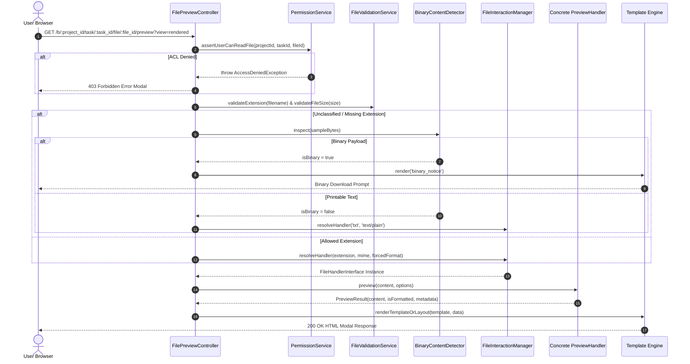
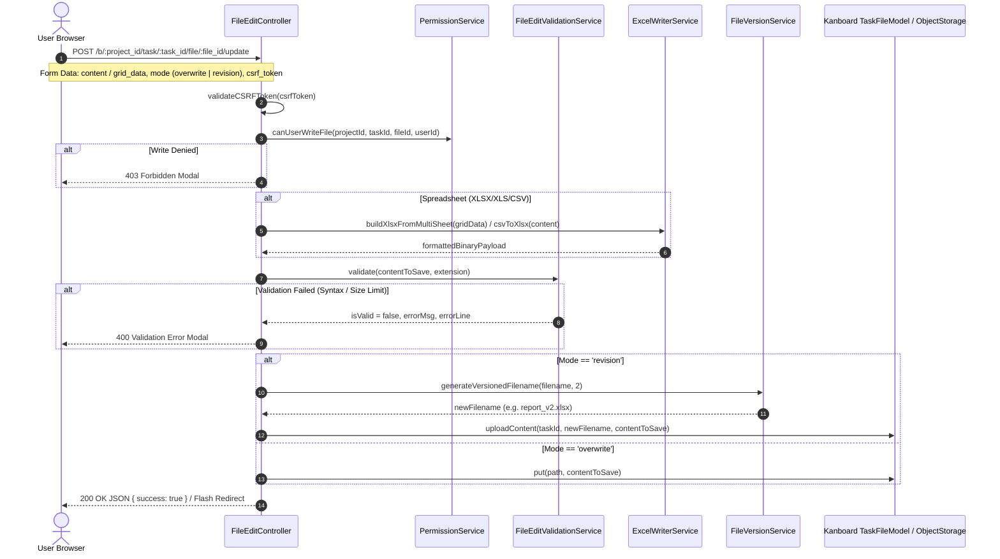

# Architecture Overview & Technical Design

`kanboard-file-interaction-core` provides a modular, extensible, and secure framework for previewing, processing, streaming, and editing file attachments in Kanboard without modifying core files.

---

## 🏛️ 1. High-Level System Architecture

```mermaid
graph TD
    classDef entry fill:#e3f2fd,stroke:#1565c0,stroke-width:2px;
    classDef controller fill:#f3e5f5,stroke:#7b1fa2,stroke-width:2px;
    classDef service fill:#e8f5e9,stroke:#2e7d32,stroke-width:2px;
    classDef handler fill:#fff3e0,stroke:#e65100,stroke-width:2px;
    classDef output fill:#fce4ec,stroke:#c2185b,stroke-width:2px;

    UI[🖥️ Kanboard Web Interface]:::entry -->|Routes / Hooks| Plugin[Plugin.php Entry Point]:::entry

    subgraph Controllers [Controller Layer]
        Plugin --> FPC[FilePreviewController]:::controller
        Plugin --> FEC[FileEditController]:::controller
        Plugin --> FSC[FileStreamController]:::controller
        
        Trait[Concerns: HandlesAttachmentInteraction]:::controller -.-> FPC
        Trait -.-> FEC
        Trait -.-> FSC
    end

    subgraph SecurityServices [Security & Validation Layer]
        PS[PermissionService<br/>ACL Verification]:::service
        FVS[FileValidationService<br/>Extension, Path & Size Caps]:::service
        BCD[BinaryContentDetector<br/>Bounded 8 KB Content Sniffer]:::service
        FEVS[FileEditValidationService<br/>JSON & Size Pre-Save Check]:::service
    end

    FPC --> PS
    FPC --> FVS
    FPC --> BCD
    FEC --> PS
    FEC --> FEVS
    FSC --> PS
    FSC --> FVS

    subgraph HandlerRegistry [Handler Strategy & Registries]
        FIM[FileInteractionManager<br/>Strategy Registry]:::service
        SLR[SyntaxLanguageRegistry]:::service
        CDR[CsvDelimiterRegistry]:::service
        PVMR[PreviewViewModeRegistry]:::service
        
        FPC --> FIM
        FPC --> SLR
        FPC --> CDR
        FPC --> PVMR
    end

    subgraph Handlers [Format Preview Strategies]
        APH[AbstractPreviewHandler]:::handler
        FIM --> APH
        
        APH --> TextH[TextPreviewHandler]:::handler
        APH --> JsonH[JsonPreviewHandler]:::handler
        APH --> MdH[MarkdownPreviewHandler]:::handler
        APH --> CsvH[CsvPreviewHandler]:::handler
        APH --> XlsxH[ExcelPreviewHandler]:::handler
        APH --> DocxH[DocxPreviewHandler]:::handler
        APH --> PptxH[PptxPreviewHandler]:::handler
        APH --> PdfH[PdfPreviewHandler]:::handler
        APH --> CodeH[CodePreviewHandler]:::handler
    end

    subgraph ParserServices [Domain Parser & Writer Services]
        DocxParser[DocxParserService]:::service
        PptxParser[PptxParserService]:::service
        ExcelParser[ExcelParserService]:::service
        ExcelWriter[ExcelWriterService]:::service
        CsvParser[CsvParserService]:::service
        MdParser[MarkdownParserService]:::service
        VersionSvc[FileVersionService]:::service
        Emitter[HttpStreamEmitter]:::service

        DocxH --> DocxParser
        PptxH --> PptxParser
        XlsxH --> ExcelParser
        CsvH --> CsvParser
        MdH --> MdParser
        FEC --> ExcelWriter
        FEC --> VersionSvc
        FSC --> Emitter
    end

    subgraph Presentation [Templates & Client Controllers]
        Modal[Modal Dialog / Full Layout]:::output
        OfficeJS[office-viewer.js]:::output
        EditorJS[editor.js]:::output
        ControlsJS[preview-controls.js]:::output
        
        FPC --> Modal
        FEC --> EditorJS
        FSC --> OfficeJS
        Modal --> ControlsJS
    end
```



---

## 🔄 2. Interaction Lifecycles & Sequence Flows

### A. Preview Request Sequence Flow



---

### B. Live Editor & Versioning Sequence Flow



---

### C. Inline PDF & Office Binary Streaming Flow

```mermaid
sequenceDiagram
    autonumber
    actor User as User Browser
    participant FSC as FileStreamController
    participant ACL as PermissionService
    participant Val as FileValidationService
    participant Emitter as HttpStreamEmitter

    User->>FSC: GET /b/:project_id/task/:task_id/file/:file_id/stream
    FSC->>ACL: assertUserCanReadFile(projectId, taskId, fileId)
    FSC->>Val: sanitizeFilename() & validateFileSize()
    FSC->>FSC: assertMagicSignature(extension, content)
    
    Note over FSC,Emitter: Build Framing Security Headers
    FSC->>Emitter: emitHeader('Content-Type', 'application/pdf')
    FSC->>Emitter: emitHeader('Content-Security-Policy', "default-src 'none'; frame-ancestors 'self'")
    FSC->>Emitter: emitHeader('X-Content-Type-Options', 'nosniff')
    FSC->>Emitter: emitHeader('Cache-Control', 'private, max-age=300')
    FSC->>Emitter: removeHeader('X-Frame-Options')
    
    FSC->>Emitter: emitBody(content)
    Emitter-->>User: 200 OK Inline Binary Stream
```

---

## 🧩 3. Core Design Patterns

### 1. Strategy Pattern (`FileHandlerInterface` & `AbstractPreviewHandler`)
Every format previewer is an isolated strategy class implementing `FileHandlerInterface`. The base class `AbstractPreviewHandler` encapsulates common logic (size clamping, line counting, UTF-8 char counting, output escaping, extension normalization) ensuring DRY, maintainable handlers.

### 2. Registry Pattern (`FileInteractionManager`, `SyntaxLanguageRegistry`, `CsvDelimiterRegistry`, `PreviewViewModeRegistry`)
- `FileInteractionManager`: Dynamically registers and resolves file handlers based on extension, MIME type, and priority ordering.
- `SyntaxLanguageRegistry`: Central source of truth for supported syntax languages, comment styles, and language options.
- `CsvDelimiterRegistry`: Normalizes and matches delimiter tokens (comma, semicolon, tab, pipe) with auto-detection fallback.
- `PreviewViewModeRegistry`: Manages `rendered` vs `raw` view modes and human-readable type labels.

### 3. Concerns & Trait Composition (`HandlesAttachmentInteraction`)
Shared controller logic is encapsulated into `HandlesAttachmentInteraction`:
- Container probe method (`hasService()`).
- Attachment metadata lookup across `taskFileModel` and `projectFileModel`.
- Project ID resolution via `taskFinderModel`.
- Safe storage retrieval with directory traversal prevention.
- Unified modal vs layout rendering and error response formatting.

---

## 🔒 4. Security Principles
See [docs/SECURITY.md](docs/SECURITY.md) for the detailed threat model and technical mitigation guarantees.
