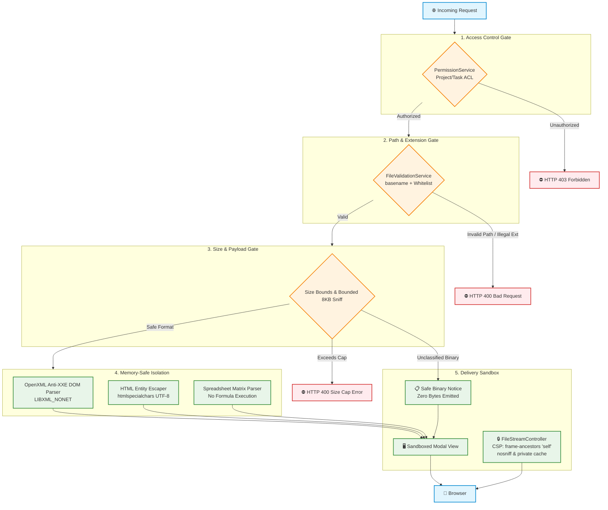

# Security Specification & Threat Model

Security is the primary non-negotiable requirement for `kanboard-file-interaction-core`. All file attachments uploaded by users are considered **untrusted hostile input**.

---

## 🛡️ 1. Multi-Layer Defense-in-Depth Model



---

## 🔒 2. Threat Categories & Technical Mitigations

### 1. Cross-Site Scripting (XSS)
- **Threat**: Uploaded files contain malicious script payloads (`<script>`, inline SVG JS, HTML attributes, event handlers) to hijack user sessions.
- **Mitigation**:
  - All plain text, JSON values, table cells, slide contents, and metadata are escaped using `htmlspecialchars($str, ENT_QUOTES | ENT_SUBSTITUTE, 'UTF-8')`.
  - Raw HTML and SVG rendering is strictly disabled. Even HTML attachments (`.html`, `.htm`) are displayed as **escaped source code** in the syntax viewer.
  - Active content extensions (`.svg`, `.html`, `.js`) are explicitly excluded from inline streaming endpoints.

### 2. Path Traversal & Arbitrary File Reads
- **Threat**: Manipulated filenames (`../../../../etc/passwd`, `C:\boot.ini`, null bytes) used to read sensitive host files.
- **Mitigation**:
  - `FileValidationService::sanitizeFilename()` wraps all filenames in `basename()` checks and rejects null bytes (`\0`) and dot sequences (`.`, `..`).
  - Attachment records are looked up exclusively via Kanboard internal numeric primary keys (`file_id`), never user-supplied file paths.

### 3. XML External Entity (XXE) & SSRF in Office Documents
- **Threat**: Uploaded `.docx`, `.pptx`, or `.xlsx` OpenXML ZIP packages containing crafted `<!ENTITY>` tags attempting to trigger external DTD lookups or local file inclusion.
- **Mitigation**:
  - `DocxParserService` and `PptxParserService` enforce strict libxml security flags during DOM parsing:
    ```php
    libxml_use_internal_errors(true);
    $dom->loadXML($xmlContent, LIBXML_NONET | LIBXML_NOBLANKS);
    ```
  - Disabling external network fetching (`LIBXML_NONET`) guarantees XXE injection is neutralized.

### 4. Clickjacking & Frame Hijacking of Inline Streams
- **Threat**: Third-party malicious sites embedding Kanboard attachment stream URLs in `<iframe>` elements to spy on confidential PDFs or trick authenticated users.
- **Mitigation**:
  - Kanboard core's default `X-Frame-Options: DENY` blocks embedded `<object>` rendering. `FileStreamController` overrides this specifically for inline binary streams using standardized CSP:
    ```http
    Content-Security-Policy: default-src 'none'; frame-ancestors 'self'
    X-Content-Type-Options: nosniff
    Cache-Control: private, max-age=300
    ```
  - `frame-ancestors 'self'` restricts iframe/object embedding exclusively to the Kanboard origin.
  - `default-src 'none'` ensures the streamed document cannot initiate outbound subresource requests.

### 5. Memory Exhaustion & Denial of Service (DoS)
- **Threat**: Giant multi-gigabyte files causing PHP worker memory exhaustion (OOM crashes) during parsing or buffering.
- **Mitigation**:
  - Hard per-format size limits are enforced before loading payloads into memory:
    - Text / Code / JSON: **500 KB**
    - Spreadsheets (Excel): **5 MB**
    - Word & PDF Documents: **10 MB**
    - PowerPoint Presentations: **15 MB**
  - For unclassified attachments, `FilePreviewController::CONTENT_READ_CEILING_BYTES` (10 MB) verifies the database row's declared size before initiating object storage reads.
  - OpenXML cell/row iteration includes truncation guards (`maxRows`, `maxColumns`).

### 6. Bounded Inspection of Unknown Attachments
- **Threat**: Allowing arbitrary file extensions could route unknown binaries to text highlighters or cause uncontrolled buffer allocation.
- **Mitigation**:
  - `BinaryContentDetector` inspects a **bounded 8 KB head sample**.
  - If null bytes or a control-character ratio exceeding 10% are detected, the file is classified as binary.
  - Binary payloads emit a safe download notice with **zero file content** transmitted.
  - Printable text is rendered strictly through `TextPreviewHandler` with entity escaping.

### 7. CSRF & Write Protection in Live Editor
- **Threat**: Cross-Site Request Forgery modifying attachment contents or overwriting project files.
- **Mitigation**:
  - `FileEditController::update()` requires valid CSRF tokens validated against Kanboard's `Token` service.
  - Write permissions require `PermissionService::canUserWriteFile()`, which — since v1.1.0 —
    resolves to `KanboardPermissionChecker::canWriteProject()` and tests
    `projectPermissionModel->isMember()`. Read access is deliberately **not** sufficient:
    a project viewer may open an attachment but must not overwrite it.
  - Pre-save validation (`FileEditValidationService`) checks JSON syntax and enforce size limits before writing to storage.

### 8. Object-Level Authorization for Attachments

- **Threat**: Kanboard authorizes these routes with `projectAccessMap`, which
  `ProjectAuthorization` evaluates against the `project_id` **carried in the URL**. It
  proves the caller holds a role on *that* project and inspects nothing about `file_id`.
  Because the controllers resolve attachments with `getById($fileId)` — keyed on the id
  alone — a caller could pair a project they legitimately belong to with a foreign
  attachment id and reach a file from a project they cannot see.
- **Mitigation**: `HandlesAttachmentInteraction::assertAttachmentOwnership()` joins the two
  facts before any bytes are read, on all four actions (`preview`, `stream`, `edit`,
  `update`). The attachment row's own `task_id` / `project_id` must match the URL, and the
  owning task must sit in the project whose role was checked.
- **Assumption**: the ownership columns come from the database, never from the request, so
  they cannot be forged by a caller. A row that declares no owner cannot be cross-checked
  and is left to the route ACL alone.
- **Regression cover**: `tests/Unit/AttachmentAuthorizationTest.php`.

> **History**: both this gate and the `isMember()` write check were introduced in
> **v1.1.0**. Before that release `PermissionService` defaulted to
> `MockPermissionChecker(true)` — a test stub that approves everything — and no controller
> injected an alternative, so the plugin's own ACL layer approved every request at runtime.
> Installations older than v1.1.0 should be upgraded.

---

## 📋 Contributor Security Checklist

Before proposing code changes:

- [ ] Is all template output wrapped in `htmlspecialchars()` or `$this->escapeHtml()`?
- [ ] Are path traversal sequences (`..`, `\0`) sanitized with `basename()`?
- [ ] Are ACL permissions verified prior to accessing storage records?
- [ ] Is the attachment confirmed to BELONG to the task/project in the URL, not merely fetched by id?
- [ ] Does every new permission path fail **closed** when the models it needs are unavailable?
- [ ] Are XML parser instances configured with `LIBXML_NONET`?
- [ ] Are file size caps checked before buffering full attachment contents?
- [ ] Are inline streaming responses secured with `frame-ancestors 'self'` and `nosniff`?
